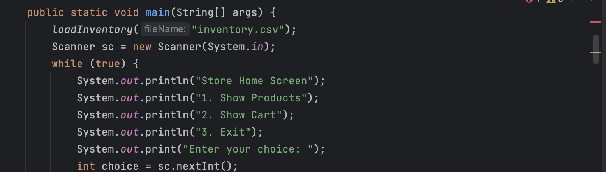
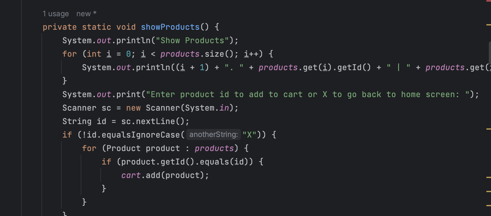
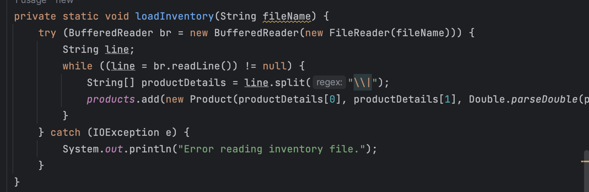

# 🛍️ Online Store App

This is a simple command-line based Online Store application that allows users to browse through a list of products, add products to their cart, and complete a transaction by paying for the items in their cart.

## ✨ Features

- 💼 Display a list of available products
- 🛒 Add products to the cart
- 📋 Show the cart with the list of items and the total amount
- 💰 Check out and pay for the items in the cart
- ⚠️ Handle erroneous inputs and display error messages

## 🖼️ Screenshots

| Home Screen                           | Products Display Screen                               | Cart Screen                           | Error Message                             |
|---------------------------------------|-------------------------------------------------------|---------------------------------------|-------------------------------------------|
|  |  |  |  |

## 💡 Interesting Code Snippet

```java
private static void checkOut(double total) {
    System.out.println("Check Out");
    System.out.println("Total amount owed: " + total);
    System.out.print("Enter payment amount: ");
    Scanner sc = new Scanner(System.in);
    double payment = sc.nextDouble();
    if (payment < total) {
        System.out.println("Not enough payment. Please enter the full amount.");
        checkOut(total);
    } else {
        // ...
    }
}
